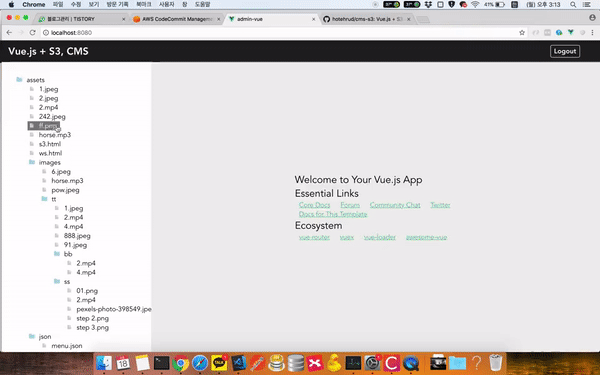

# Vue.js + S3 => TreeView CMS 

> You can build CMS for S3 bucket.

## Website UI



## functions
- Treeview for lists in S3 Bucket
- Drag And Drop
- Create, Delete, Rename for folder and file
- Upload for file
- Download for file
- Preview for file(Image, Audio, Video)
- Authrorize(Cognito)

## Requirements
** Use this app along with the S3 Bucket **
- [AWS S3](https://aws.amazon.com/s3/)
- [Coginto](https://aws.amazon.com/cognito) - Optional
- [aws-sdk for javascript](https://docs.aws.amazon.com/ko_kr/sdk-for-javascript/v2/developer-guide/getting-started-browser.html)
- [Vue.js](https://github.com/vuejs/vue) (vue-cli 2.x|vuex|vue-router|scss)

## Directory Architecture

<pre>
 ┬  
 ├ assets
 ├ components
     ┬ 
     ├ *
     ├ shard-components
 ├ config    
 ├ mixins
 ├ router
 ├ store
 ├ views
 ├ authorize.js
 ├ s3.js
</pre>

## Build Setup

- Need modify variables in src/config/s3.js.
- Need modify src/authorize.js => ex) coginto.

``` bash
# install dependencies
npm install

# serve with hot reload at localhost:8080
npm run dev

# build for production with minification
npm run build

# build for production and view the bundle analyzer report
npm run build --report
```

For a detailed explanation on how things work, check out the [guide](http://vuejs-templates.github.io/webpack/) and [docs for vue-loader](http://vuejs.github.io/vue-loader).
